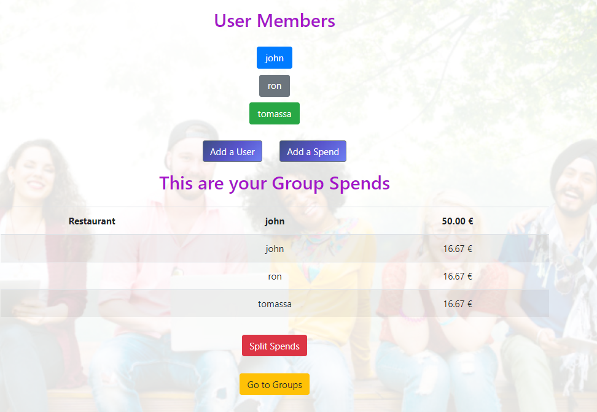

# SettleWise: Split your group spendings

          
  
## Target
SettleWise is a application that allows you to make a group with the people you want, for exemple: your family, friends, etc. and share your spendings as a group, allowing you to set the people who is participating on the spend and the amount of each user. The application will tell you who must to pay to whom and how much.

  
 ## Functional description
This application allows you to create a group, invite users to the group, add the spendings of the group, and tell you who have more debts to solve.

  
## Use case diagram

 
  
## Data Models

 
  
 ## Screenshots

 

 

 

 
  
 
 

 

  
## Technical Steps to Start App in Local

### 1º- Server side: 

Install dependencies and modules from package.json. Use command “npm install” on each of the folders:
   -server/data
   -server/logic
   -server/api

START SERVER on localhost from server/api. Command: node .

### 2º- Client side:

Install dependencies and modules from package.json. Use command “npm install” on each of the folders:
   -client/api
   -client/app (React)

START REACT APP on browser from client/app. Command: npm start